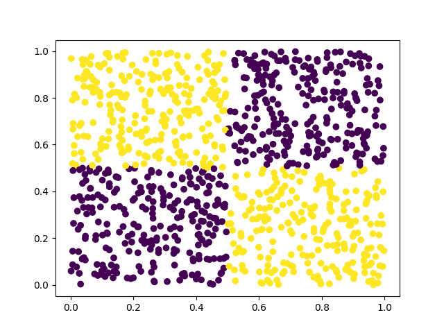

# CS3P01 - Cloud Computing: Final Course Project

_Note_: This project was developed as the simple use case of Kubeflow usage. The ellaborate use case project can be found in the following GitHub repository: https://github.com/GioCS17/proyecto_cloud

## Project Description

The project consists in developing a complete and functional Kubeflow pipeline for a real research project in Machine Learning. This project should consider:

- Data generation / retrieval.
- Training of multiple models.
- Compare models on the test phase with plots.
- Hyperparameter tuning with Katib.

In detail, the project considers the classification task for the XOR problem. In this task, points are drawn uniformly at random in the range [0, 1] in a 2D plane (although an implementation can be extended to _n_ dimensions). Each point has a label corresponding to the XOR operator of the rounded values of the point's coordinates in the plane (check the image from scatter plots for a reference). The idea is to obtain a model that can correctly classify each sample point as belonging to each quadrant of the XOR operator.

Theoretically, a linear model should not be able to learn a set of parameters that solves the XOR problem because points are spread in a way that makes it impossible for a single line to divide appropriately. In contrast, a non-linear model with higher capacity (such as a neural network with hidden layers) should be able to correctly classify points for the XOR problem with almost perfect accuracy. In this project we use Kubeflow as the framework in which this whole machine learning research workflow takes place.

## Project Steps

### Summary

- Docker image with saved state of the current version of the project.
- Pipeline with multiple components:
    - XOR generator component: Generates points samples and returns both a training set and test set.
    - Sample scatter plot component: Loads the training and test set and makes a scatter plot of the sampled points. This is conditioned on the variable _dims_, which should be equal to 2 for the plot to be generated.
    - Train component: Loads the training set, instantiates a neural network model given a configuration, trains the model with the dataset, and saves the model weights and training metrics to a folder.
    - Training plots component: Loads training metrics from two models and generates a plot that compares both models on each of the metrics.
- Manual parameter configuration for runs using Kubeflow's Central Dashboard.

### Dataset

The dataset consists of a training set and test set of points obtained from the the XOR generator. In particular, we sampled 10000 points for the training set and 1000 points for the test set.

_Training (10000 samples):_

_Testing (1000 samples):_

### Models

This project considered two simple neural network architectures for the classification task: a model with no hidden layers, and a model with one hidden layer.

### Training

Both models were trained for 1000 epochs with identical hyperparameters, with the only difference in the number of hidden layers. There are two metrics that are recorded during training for both models: the training loss and the training accuracy.

_Note_: The training accuracy plot has the wrong scaling in the y-axis because the accuracy metric should have been normalized over the number of samples in the training set. This would result in values in the range [0, 1], which is the usual range for the accuracy.

The results from this experiment show that a neural network with a hidden layer is able to learn faster and more accurately than a neural network with no hidden layers. This means that higher capacity

## Kubeflow

This project used Kubeflow to enable a simple transition from python scripts to a more ellaborate pipeline of components. Kubeflow allowed for conteinerized components that could be connected together easily through Kubeflow Pipelines interface for Python. Although this project wasn't launched in a public domain, Kubeflow allows for portable experiments that could have been configured and runned from different devices through Kubeflow Central Dashboard.

### Docker Hub

The latest image of the project can be found at [Docker Hub](https://hub.docker.com/r/cesarsalcedo/cs3p02_kubeflow_project/tags).

### Pipeline

The pipeline for this machine learning workflow is described by the script in `pipeline.py`. The resulting YAML file describes a pipeline that can be visualized as in the following graph:

### Runs

Runs were executed successfully using Kubeflow Central Bashboard. Kubeflow makes experiment configuration and launching easy by providing an interface to the pipeline parameters. By using this interface, it was possible to set the configuration for the experiments (setting the number of samples for the training and test set, the number of dimensions of the dataset, and the number of training epochs). A successful run produces the following execution graph:

## Project deliverables

### Kubernetes deployment

Kubeflow, by definition (and by its name), is tightly related to Kubernetes. This is the case because Kubeflow works under the assumption that the Machine Learning workflow can be separated into multiple processes that meet some specific functionality (e.g. data preparation, training, testing). For this reason, the set of functional components can be encapsulated as containers, which can be run given some parameters to produce outputs that can be used later for other components. The fact that these components are containerized functions leads to the notion of a graph of computation, namely the Kubeflow Pipelines graph for this use case, which describes the flow of information along a complete run of a Kubeflow experiment. On each run, components are instantiated and run with the input parameters received from the user and other containers. As we are working with Kubernetes, the execution of components is independent from other components, and can have different sets of installed packages without inherent compatibility issues.

### Storage

Data from Kubeflow is automatically stored in the computer after the execution of each component. This is both useful and necessary for components to be able to share information with one another. Whenever a component is expected to deliver its output as the input of another component, data is copied from the source component to the target component. This data is kept in Kubeflow throughout the whole run, even after the run has finished its execution. One can access the data from all past runs directly from Kubeflow Central Dashboard.

### Scalability and Monitoring

Kubeflow is designed to meet scalability requirements. Scalability is essential for Machine Learning projects, since the workflow data scientists usually use consists of first performing some experiments in their personal computer and then scaling to a computer cluster. Kubeflow accounts for this condition by distributing ML tasks across user-available computing resources (e.g. CPUs, GPUs, nodes) without the need of updating the code.

In a similar way, Kubeflow has a monitoring system that automatically updates the information about the cluster in the Kubeflow Central Dashboard. In particular, the home screen shows a summary about the user's resources and experiments, while other tabs further speciallize in each of the fields they refer to. For example, the Runs tab shows all relevant information about runs, providing the run configuration (input parameters), status (pending, running, successful, or fail), and results (including logs, plots, and captions). All this information is updated at a regular basis for the user to get the most recent status of his experiments.

### Aditional topic: multi-tenancy

Kubeflow is designed to be used by multiple users simultaneously as a service in the cloud. This is done by assigning a namespace for each user. A namespace holds all the resources a user needs, and isolates the execution of experiments from other users. This is specially useful to prevent overwriting results while meking it possible to execute all the normal operations of Kubeflow simulaneously along other users.

### Monitoring metrics

It was possible to test the execution of the program with different workloads by updating parameters directly from the Kubeflow Central Dashboard. For example, we could test across runs with a varying number of epochs, which resulted in the following graphs:

- Training accuracy for 1000 epochs

- Training accuracy for 10000 epochs

### Analisis from metrics

The metrics plot show that 10000 epochs do not result in any observable improve in performance in the model compared to 1000 epochs, since accuracy converges to 1 right after 500 epochs.

## Future work

- Automate hyperparameter tunning via Katib
