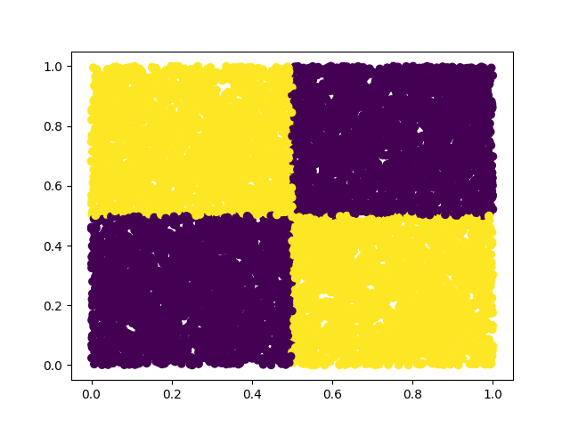

# CS3P01 - Cloud Computing: Final Course Project

## Project Description

The project consists in developing a complete and functional Kubeflow pipeline for a real research project in Machine Learning. This project should consider:

- Data generation / retrieval.
- Training of multiple models.
- Compare models on the test phase with plots.
- Hyperparameter tuning with Katib.

In detail, the project considers the classification task for the XOR problem. In this task, points are drawn uniformly at random in the range [0, 1] in a 2D plane (although an implementation can be extended to n dimensions). Each point has a label corresponding to the XOR operator of the rounded values of the point's coordinates in the plane (check the image from scatter plots for a reference). The idea is to obtain a model that can correctly classify each sample point as belonging to each quadrant of the XOR operator.

Theoretically, a linear model should not be able to learn a set of parameters that solves the XOR problem because points are spread in a way that makes it impossible for a single line to divide appropriately. In contrast, a non-linear model with higher capacity (such as a neural network with hidden layers) should be able to correctly classify points for the XOR problem with almost perfect accuracy. In this project we use Kubeflow as the framework in which this whole research process takes place.

## Project Status

_Note_: The current image of the project can be found at [Docker Hub](https://hub.docker.com/r/cesarsalcedo/cs3p02_kubeflow_project/tags).

### Done

- Docker image with saved state of the current version of the project.
- Pipeline that successfully loads data and saves sample scatter plots.
- Manual parameter manipulation with Kubeflow's Central Dashboard.

#### Pipeline

The current pipeline produces the following graph:

#### Scatter Plots

_Training (100 samples):_

_Testing (10 samples):_

### Pending

- Train neural network models.
- Compare models in terms of loss and accuracy plots.
- Automate hyperparameter tunning via Katib
